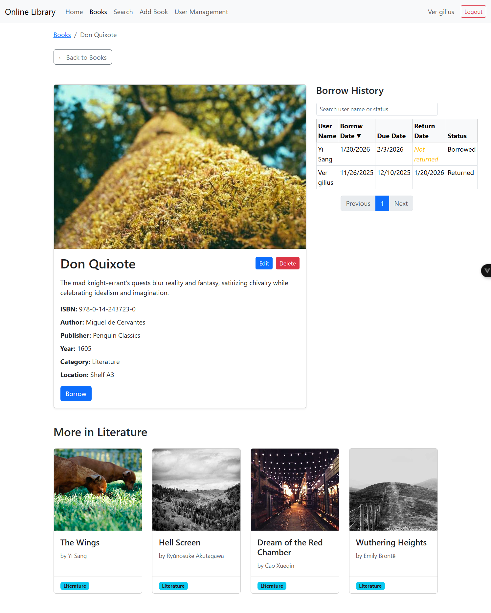

# COMP3047 Library Management System

**Course Project for COMP3047** – Full-Stack Web Development

This repository contains a complete full-stack **Online Library Management System** built as a student learning project for the COMP3047 course.

Note that this is **not** a real library system for any faculty or institution. It is an educational demonstration to practice modern web development concepts and technologies.


## Features Implemented

- Responsive UI (desktop + mobile)
- Book CRUD operations (Admin only)
- Advanced search, filters, sorting & pagination
- Highlighted / latest / trending / hot books on homepage
- Book borrowing & returning (authenticated users)
- Admin-only user management (CRUD)
- JWT-based login + protected routes/endpoints
- Form validation, error handling, loading states


## Screenshots of User Panel (Desktop & Mobile View)
Note that Desktop View is on the left while Mobile View is on the right.


### Homepage
  |  

### Login Page
  |  

### Overview of Books
  |  

### Book Details

  |  

## Screenshots of Admin Panel
### Booking Record


### Books Adding and Editing
  |  

### Account Management
    |  

## Tech Stack

**Backend**
- Node.js + Express.js
- MongoDB (Mongoose ODM)
- JWT (jsonwebtoken) for authentication
- Role-based middleware

**Frontend**
- Vue 3 (Composition API + `<script setup>`)
- Vue Router (with navigation guards)
- Fetch API + JWT token handling
- Bootstrap 5 (responsive layout)
- Oruga UI (`o-table`) for data tables (users & borrow history)

## Setup & Run Locally

### Prerequisites
- Node.js ≥ 18
- MongoDB (local or MongoDB Atlas)

### Backend
```bash
cd backend
npm install        
npm start
```

Backend is available at: `http://localhost:3000`. It serves without api for website testing.

### Frontend
```bash
cd frontend
npm install
npm audit fix            # optional
npm run dev
```

Frontend is available at: `http://localhost:5173`. It serves with api for constant service.

(Configure proxy in `vite.config.js` for development: `/api` → backend)

## License

Built as part of **COMP3047** coursework – for educational purposes only.
- Backend [GitHub](https://github.com/UG-CS-HKBU/comp3047-fall2024-express-template)
- Frontend: [GitHub](https://github.com/UG-CS-HKBU/comp3047-fall2024-vue-template)
